This is a tutorial on _hctsa_ time-series classification using the [Bonn University EEG dataset](http://epileptologie-bonn.de/cms/front_content.php?idcat=193&lang=3).

A recording of the tutorial is on [YouTube](https://youtu.be/YwPX3rWxP_Y) (the analysis of this dataset is around the 1:52:00 mark).

It will walk you through a basic analysis of the data, and a classification of the different labeled states from time-series features of the EEG.

The paper that introduced this dataset is:

Andrzejak, Ralph G., et al. (2001)
"Indications of nonlinear deterministic and finite-dimensional structures in time series of brain electrical activity: Dependence on recording region and brain state."
_Physical Review E_ __64__(6): 061907.
[Link](https://doi.org/10.1103/PhysRevE.64.061907).

The dataset contains 100 examples each of five classes of EEG data: `eyesOpen`, `eyesClosed`, `epileptogenic`, `hippocampus`, `seizure`.

We're going to try to understand the patterns in this dataset, and use highly comparative time-series analysis to classify the different classes.

You're going to need [hctsa](https://github.com/benfulcher/hctsa) installed.

## Computing

### Initializing an _hctsa_ computation (`TS_Init`)

Let's first check out how we would set this dataset up for an _hctsa_ analysis.
The first step is setting up the time series; you can see the input file that I've set up for this dataset ([cloudstor](https://cloudstor.aarnet.edu.au/plus/s/6sRD6IPMJyZLNlN)).

I need to specify the data I want to calculate features for, and add any additional metadata (such as class labels).
_hctsa_ needs three variables:
* A 500 x 1 `labels` cell (each element gives a unique identifying name to each time series);
* A 500 x 1 `timeSeriesData` cell (each element contains the time-series data);
* A 500 x 1 `keywords` cell (each element contains a comma-delimited set of keywords--in this case I've just given each time series a single keyword corresponding to one of the five classes we want to classify).

So all of this is saved in our time-series input file, `INP_Bonn_EEG.mat`, and defines everything we need to know about the time series.
There are two files in _hctsa_ (`INP_ops.txt` and `INP_mops.txt`) that do a similar job for the time-series features (as `Operations`, what we call the individual features, and `MasterOperations`, the specific pieces of code and their inputs that output sets of features).

This default feature library is used by default when we initialize our dataset:
```matlab
TS_Init('INP_Bonn_EEG.mat')
```
Running this will initialize the _hctsa_ analysis with a `HCTSA.mat` file containing, including tables defining the time series (`TimeSeries`) and the features (`Operations`), as well as matrices that contain the results of applying every operation to every time series (`TS_DataMat`).
Have a peek inside at these tables and matrices to get a better sense of how these _hctsa_ files are structured :eyes:.

### Computing features (`TS_Compute`)

So all we need now is to run all of these computations specified in our initialized `HCTSA.mat` file.
This is a big calculation, but you can test it by running, say, `TS_Compute(false,1,1:50)`, which will load the data from `HCTSA.mat`, compute the first time series and the first 50 operations, and save the results back to `HCTSA.mat` (the `false` flag says not to use parallel processing across cores; you can switch this `true` if you want to try that).

Because of the size of the dataset, we distributed different sets of time series across different nodes of a computing cluster using some simple shell scripts contained in [this repository](https://github.com/benfulcher/distributed_hctsa).
The result is a fully computed `HCTSA.mat` file (initialized and computed using _hctsa_ v1.03), which you can cheat and download from [cloudstor](https://cloudstor.aarnet.edu.au/plus/s/PWUIAdIeHhtkxsF).
If you download this file as `HCTSA.mat` to this tutorial directory, you will have skipped the hefty computations and can get on with the fun stuff.

#### Aside, _catch22_
For your own dataset, it's often a good idea to get a full method pieced together to test the usefulness of a feature-based analysis, but the computation time can be a barrier.
[_catch22_](https://github.com/chlubba/catch22) is a C-coded reduced set of 22 features, which (after installing) can be run very quickly from within Matlab run for a given dataset as, for example:

```matlab
TS_Init('INP_Bonn_EEG.mat','INP_mops_catch22.txt','INP_ops_catch22.txt',true,'HCTSA_catch22.mat');
TS_Compute(false);
```

Because computation is so fast, it can be a good first step to work through a sample analysis using _catch22_ features.
The same analysis can then be repeated with the full power of the comprehensive _hctsa_ feature library if required.

### Pre-filtering (`TS_Subset`)

Sometimes you might want to restrict your analysis to certain types of time series or features from the get-go.
For example, you may want to exclude features that are mean-dependent or length-dependent if you're interested in classifying time series based on their dynamical properties (rather than trivial properties of their mean level, or the length of the recording period).

For this sort of function, we can first get the IDs of features that match a certain criteria, like those tagged with the keyword `'locdep'` (location-dependent):
```matlab
[IDs_locDep,IDs_notLocDep] = TS_GetIDs('locdep','HCTSA.mat','ops','Keywords');
```

And then generate a new `HCTSA` file with only `IDs_notLocDep` features included:
```matlab
TS_Subset('HCTSA.mat',[],IDs_notLocDep,true,'HCTSA_locDepFiltered.mat')
```

### Checkin it out (`TS_InspectQuality`)

The first thing you do when you have a computed `HCTSA.mat` file on your hands is to check how the computation went.

This can be done as:

```matlab
TS_InspectQuality()
```

which by default reads in from `HCTSA.mat`, lists out all the features that had any special-valued outputs across the dataset, and plots a summary of what type of special-valued outputs they were.

In this case, we have 494 (/7702) features that produced some special-valued outputs (and they are listed to the command-line for reference):

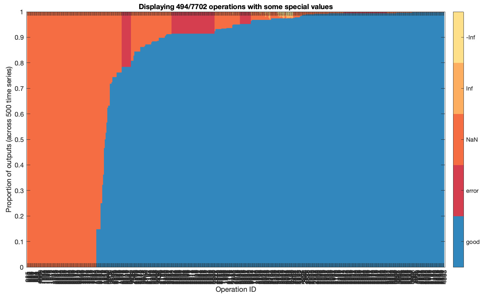

For example, we can see that some features gave `NaN` outputs for most of the dataset, and from the command-line list we see that these include features that capture properties of data distributions for positive-only data (returning a `NaN` because our EEG data are not positive-only).

So next we're going to want to clean up these types of poor-performing features.

## Normalizing and visualizing

### Filtering and normalizing (`TS_Normalize`)

We may next want to take the diverse set of >7000 features and:
1. Remove bad-performing features
2. Normalize all features to be on a similar scale

The application in mind will guide which settings to use: for example when performing classification we may not tolerate any missing values in our data at all, and some classifiers will be more or less sensitive to vast differences in scale between features (e.g., one features might be a _p_-value that varies from 0–1, while another might vary up to 10^8).

We can do both of these steps by running:
```matlab
TS_Normalize()
```
which by default filters on `[0.70,1]` (require 70%-good time series, and 100%-good features) and normalizes 'good' features using a `'mixedSigmoid'`.

This saves the new data to a new file: `HCTSA_N.mat`.
We can tell other _hctsa_ functions to load data from this file by using the `'norm'` shorthand.

### Setting up class labeling for classification (`TS_LabelGroups`)

Here we're solving a classification problem using the labels assigned to the data matrix.
We can tell _hctsa_ what labels (from the `Keywords` assigned to `TimeSeries`) we're interested in classifying.
We can run it to get a default labeling, which is assigned to the `Group` column of the `TimeSeries` table:

```matlab
TS_LabelGroups('norm')
```

In this case it can automatically assign the five groups (cf. `TS_WhatKeywords()`), because each time series only has a single keyword attached to it.

We could also focus on a two-class problem, for example, as:
```matlab
TS_LabelGroups('norm',{'eyesOpen','seizure'})
```

And we could be explicit in setting up the five-class problem, as:
```matlab
TS_LabelGroups('norm',{'eyesOpen','eyesClosed','epileptogenic','hippocampus','seizure'})
```

This stored group information can now be leveraged by other _hctsa_ plotting and analysis tools.

You can clear a given labeling as, e.g.,:
```matlab
TS_LabelGroups('norm','clear');
```

### Checking out the data (`TS_PlotTimeSeries`)

Now that the data are labelled, functions like `TS_PlotTimeSeries` will use this information automatically, to, for example, plot a fixed number of examples from each class:
```matlab
TS_PlotTimeSeries('norm')
```

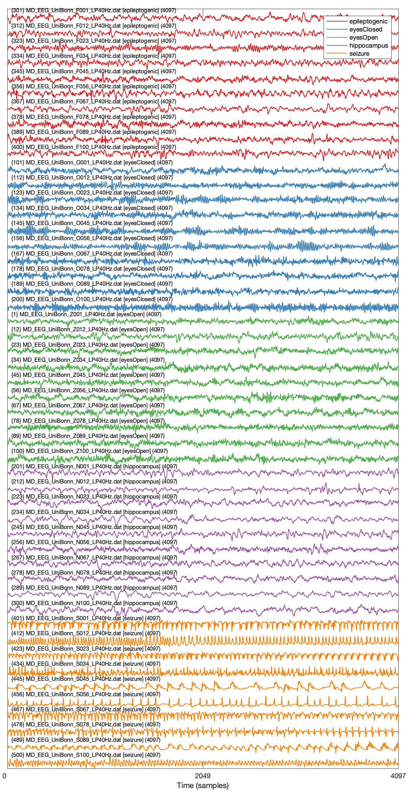

### Visualizing the data matrix (`TS_PlotDataMatrix`)

Now that all features are on a similar scale, we can try plotting it using `TS_PlotDataMatrix('norm')`.
This plots time series as rows and features as columns, with the result of evaluating each feature on each time series shown as color, from low (blue) to high (red).

Even though features are not ordered in any particular way, we can see some structure by eye, and can zoom in to see individual feature values (and some time-series segments of each row).

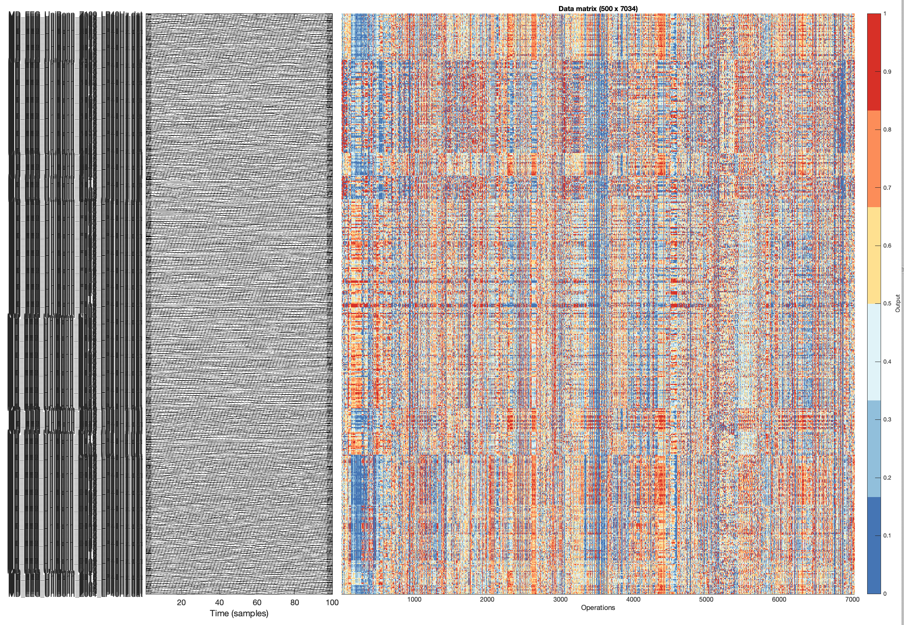

We can reorder features (and time series) to put similar rows and columns close to each other (and save this information back to `HCTSA_N.mat`):

```matlab
TS_Cluster()
```

And now we can plot the exact same matrix, but now we can visually see much more structure:

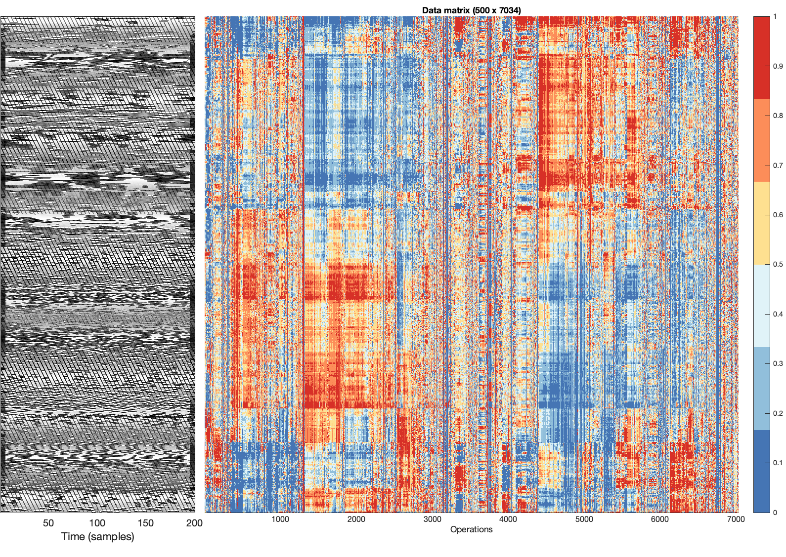

### Visualizing the dataset in a low-dimensional feature space (`TS_PlotLowDim`)

```matlab
TS_PlotLowDim('norm','pca')
TS_PlotLowDim('norm','tsne')
```

You can see how your dataset appears when projected into a two-dimensional embedding of the full feature space:

| PCA | _t_-SNE |
| ---- | ---- |
| 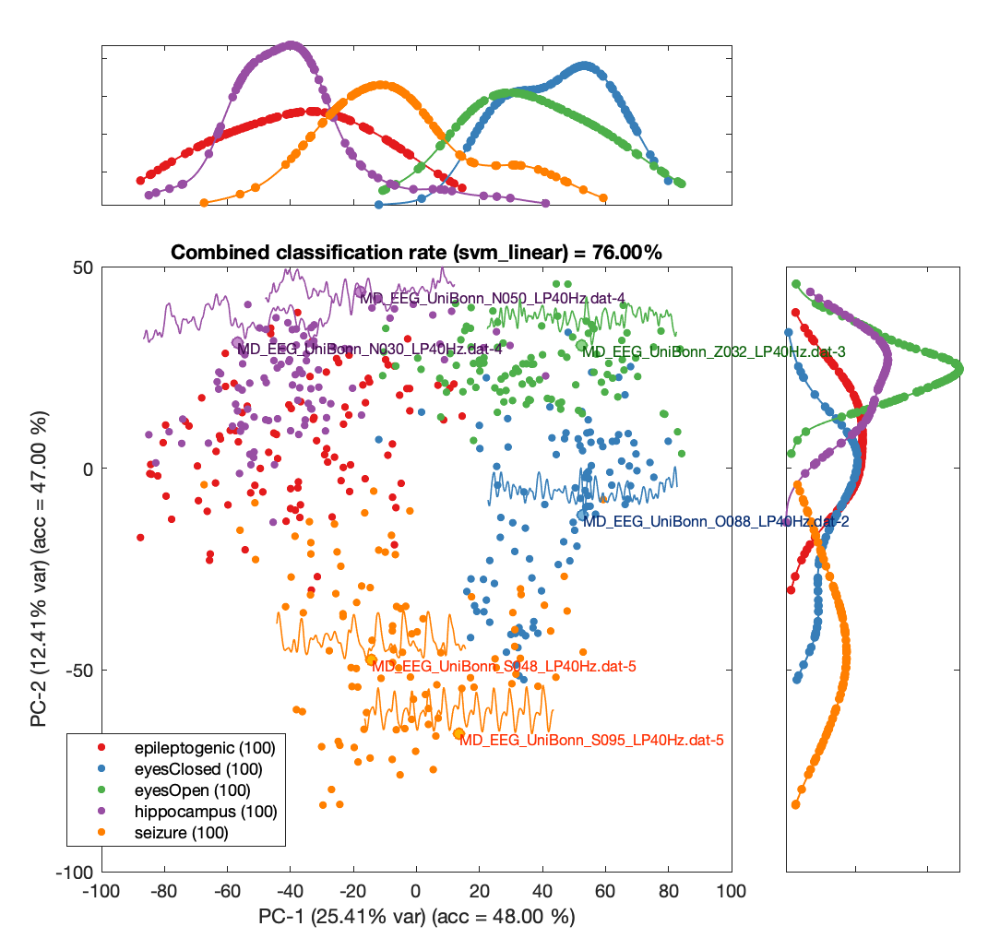 | 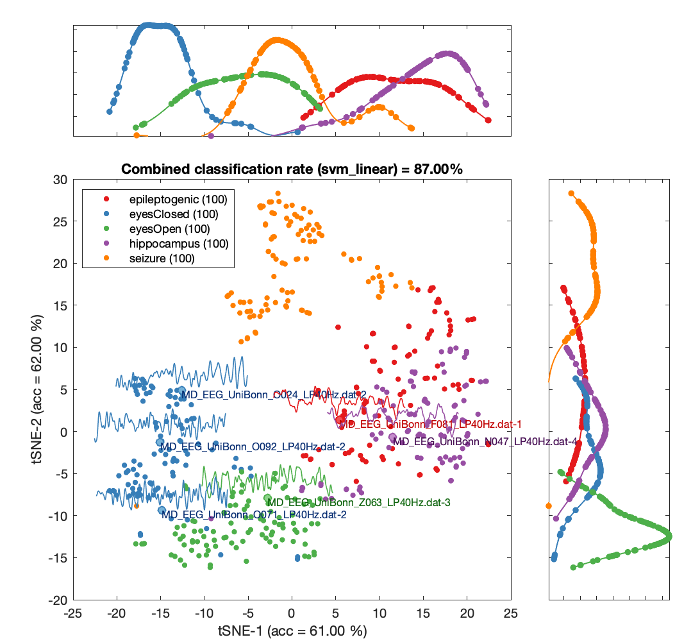 |

It will also tell you how well each individual component classifies the class labels, and an overall classification rate in the full feature space.

You can also check out a subset by relabeling the data:

```matlab
TS_LabelGroups('norm',{'eyesOpen','seizure'})
TS_PlotLowDim('norm','pca')
```

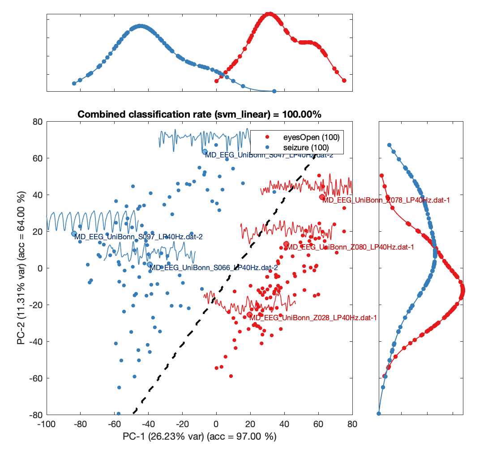

Speaking of feature-based time-series classification...

## Classifying time series

### Setting the parameters (`GiveMeDefaultClassificationParams`)

When training and evaluating a classifier, there are many decisions to make about the classification algorithm (e.g., decision tree, SVM, neural network, ...), how to train and evaluate performance when there is class imbalance, and how to properly evaluate on unseen data (e.g., using cross-validation).
We can set the default parameters for classification in `GiveMeDefaultClassificationParams`, which outputs a `cfnParams` structure.
This can be modified and passed into other functions, or you can modify this function to set more appropriate defaults.

You can check the defaults (applied to the labeling in `HCTSA_N.mat`) as:

```matlab
cfnParams = GiveMeDefaultClassificationParams('norm');
TellMeAboutClassification(cfnParams)
```

### Running a feature-based classification (`TS_Classify`)

Let's see how well we do with out default linear svm classifier at our five-class classification problem:

```matlab
TS_Classify('norm')
```

We are told:

```text
Mean (across folds) accuracy (5-class) using 10-fold svm_linear classification with 7034 features:
92.400%
```

And we get a confusion matrix:

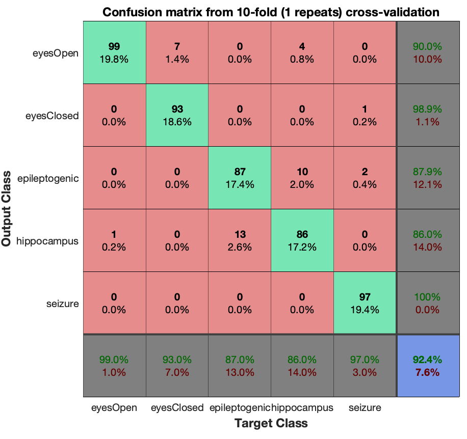

We see some eyes-open--eyes-closed confusion and some epileptogenic--hippocampus confusion.

#### Significance

In this case it's clear that 92% is far greater than chance-level accuracy (20%), but in general we might need to do some permutation testing to evaluate how surprising the observed classification accuracy is relative to a random labeling of the data.

To demonstrate how `TS_Classify` can do this, let's zoom in on a harder problem by focusing in on the hardest to classify pair:

```matlab
TS_LabelGroups('norm',{'epileptogenic','hippocampus'})
numNulls = 20; % (a small number for demonstration)
TS_Classify('norm',struct(),numNulls)
```

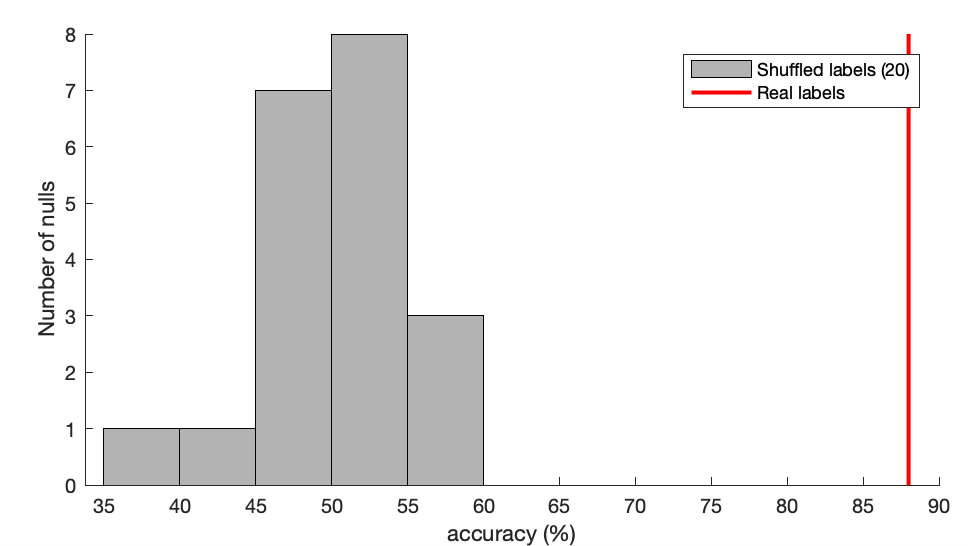

Our (very rough 20-sample) null is centered at ~50% (as it should), and has a spread that looks to drop off around 60%.
By contrast, the real labeling (>85%) is clearly highly inconsistent with the null of random labeling (and we obtain a very small _p_-value estimate).

### Checking feature-set dependence (`TS_CompareFeatureSets`)

Do specific classes of features drive the results?
It would be worrying if all of the good performance can be explained by length-dependent features...
Let's check:

```matlab
% We can boost up the number of repeats to reduce variance of a given cross-validation split:
cfnParams = GiveMeDefaultClassificationParams('norm');
cfnParams.numRepeats = 5;
TS_CompareFeatureSets('norm',cfnParams)
```

And we can see some interesting dependencies here:

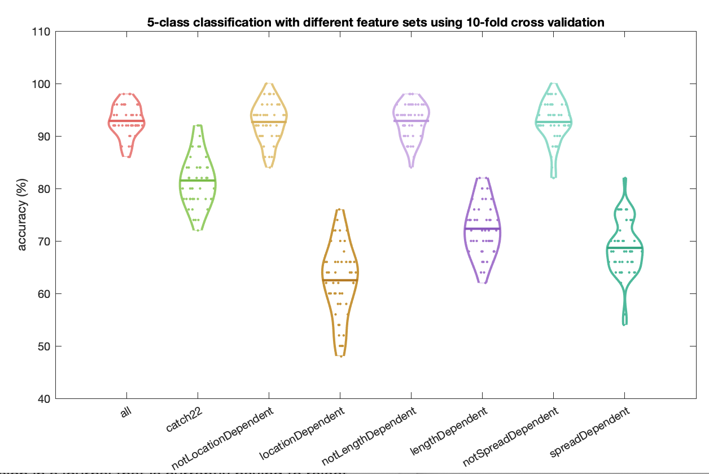

It's encouraging that removing any one of location-, length-, spread-dependent features doesn't drop the accuracy.
And we can see that if we'd have saved the many hours of computation time by just using the _catch22_ feature set, we would have gotten a decent approximation to the accuracy of the full _hctsa_ feature set (~80% instead of ~90%).

### Low-dimensional performance (`TS_ClassifyLowDim`)

We can see how well we can classify the data in low-dimensional feature spaces:

```matlab
TS_ClassifyLowDim('norm')
```

We're getting a pretty good approximation to the full feature set's classification performance with just five PCs:

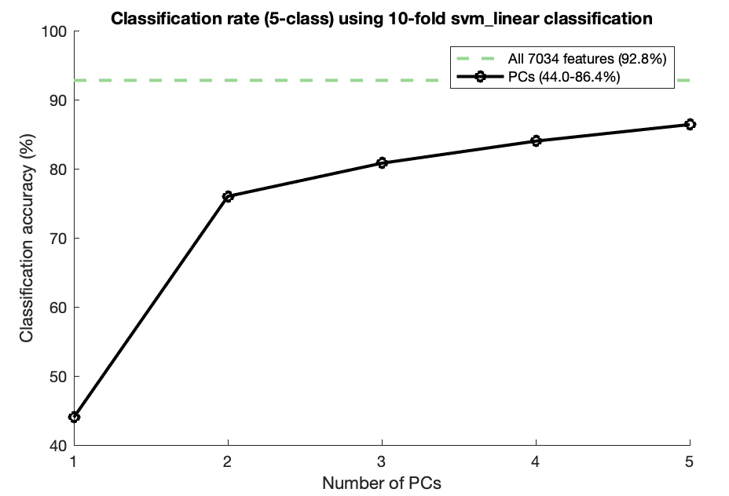

### Good individual features (`TS_TopFeatures`)

```matlab
TS_TopFeatures('norm','classification')
```

Being a five-class problem, we use a fast linear classifier to compute single-feature accuracy values.

We get a list of the most discriminative individual features to the commandline and some visualizations.

| Description | Figure |
| --- | --- |
| A distribution of accuracies across all features | 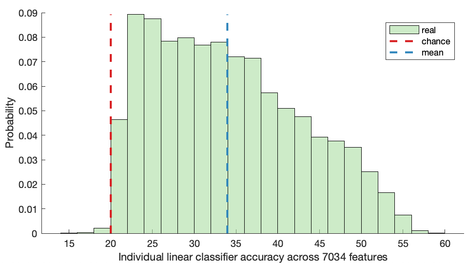 |
| Class distributions of some of the top features | 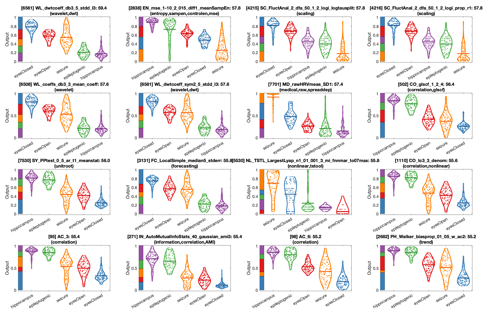 |
| Pairwise dependencies between the top features | 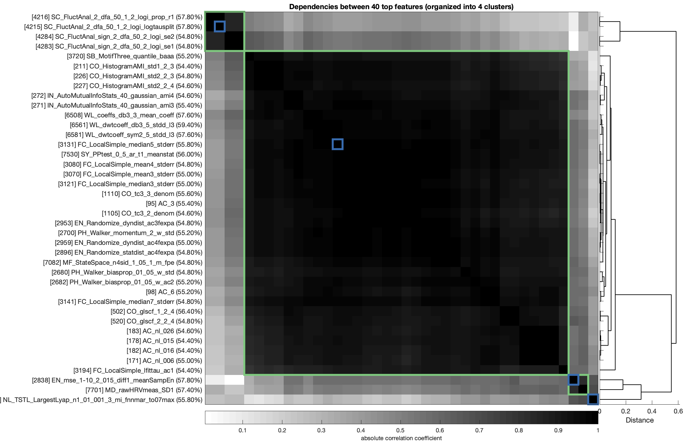 |

The final plot can be useful to interpret the groups of different types of features.

When you have two classes, you can use a more conventional statistic of inter-class difference, like say a _t_-test:

```matlab
TS_LabelGroups('norm',{'epileptogenic','hippocampus'})
TS_TopFeatures('norm','ttest')
```

You can also compare to a null distribution using randomly labeled data:

```matlab
TS_TopFeatures('norm','ttest',[],'numNulls',10)
```

Despite being a fairly rough null, you can see here that many individual features exceed null expectation:

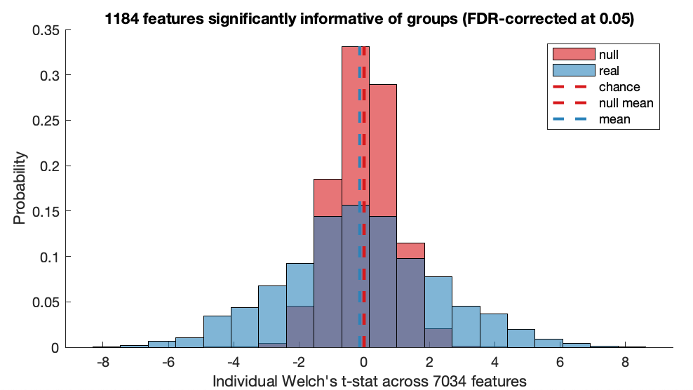

### Probing specific features (`TS_FeatureSummary`)

A guide to interpreting individual features is in the _hctsa_ documentation: the keywords can be a good guide, and you may need to go inside the code to understand what's being done.

Often large clusters of complex features are actually driven by a simpler underlying difference (e.g., nonlinear dimension estimates are sensitive to the data distribution, so strong performance by a complex feature may actually be explained by a much simpler underlying change).

There are some additional plots that can help you understand how specific features perform on your dataset.
For example, we can pick a feature that looked interesting (like `AC_3` above), and inspect it in more detail with respect to how it assigns values to time series.

We might like to look at the un-normalized time series to be able to more easily interpret the actual outputs of `AC_3` (rather than the unit interval normalized values in `HCTSA_N.mat`):

```matlab
% In interactive mode (click to explore!):
TS_FeatureSummary(95,'raw')
% Turning off interactive mode:
TS_FeatureSummary(95,'raw',true,false)
```

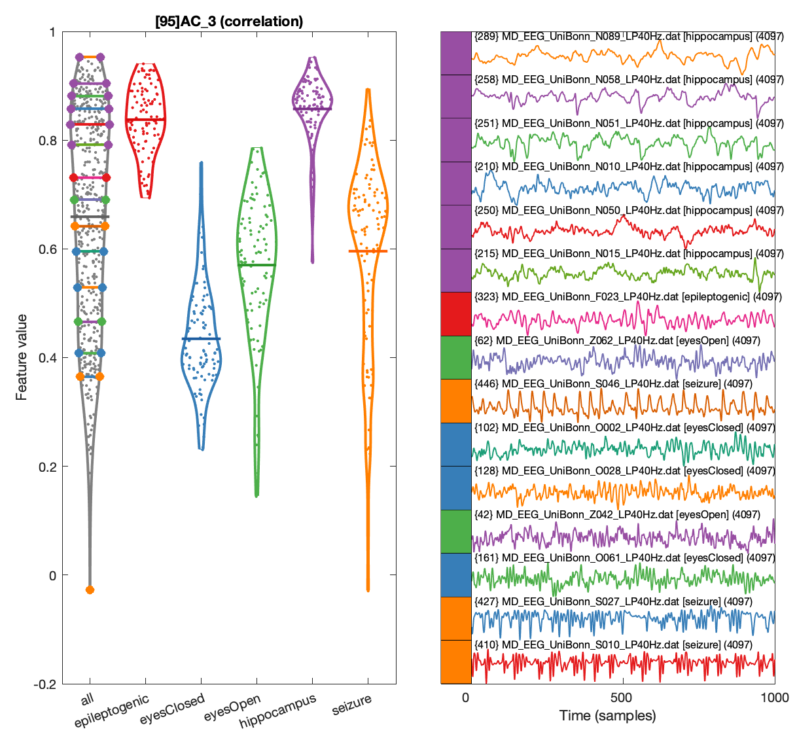

We can see the actual distribution of the autocorrelation at lag 3 and interpret how it distinguishes the classes, we can also see snippets of time series ordered by `AC_3` value.

### Extras

Visualize local neighborhods to time series in feature space:

```matlab
TS_SimSearch()
```

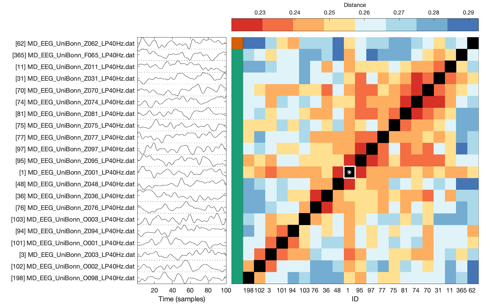

### Taking it further

_hctsa_ implements some generic algorithms for leveraging large time-series feature spaces for a given application, but for specific scientific questions you will probably want to design new analysis methods.
You can do this in Matlab, to work with the _hctsa_ `.mat` files, or export your computed data to `.csv` using `OutputToCSV` and then anlyze the exported data in another analysis environment.
